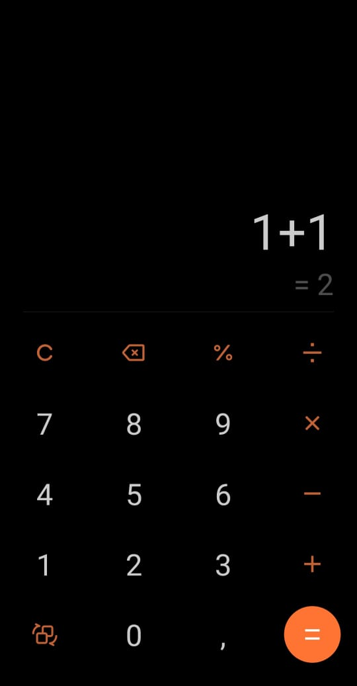

<h1 align="center">Projeto #boracodar</h1>

  
  
  <h1 align="center">Calculadora do meu celular</h1>
  

## 🔥Tentei reproduzir a mesma calculadora do meu celular

## 💻 Tecnologias

Esse projeto foi desenvolvido com as seguintes tecnologias:

- HTML e CSS
- Git e Github
- Figma
